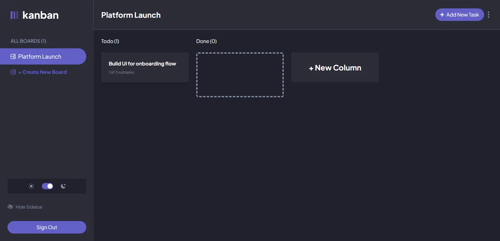

# Kanban Task Manager

A minimal, interactive Kanban board application built for project tracking. Designed with a clean dark & light mode interface to manage boards, lists, and tasks with clear subtask tracking.

## About the Project
Applied to organize your tasks with the following data: title, description, subtasks, and current workflow status.

Tasks are organized into boards and structured columns: to-do, in progress, and completed tasks. Boards, columns, and tasks can be dynamically created, edited, or deleted to manage separate project workflows from the sidebar. 

The list of tasks displays incremental subtask progress metrics (e.g., "1 of 3 subtasks") to track granular execution at a glance.

Active boards, column positioning, and light/dark mode configurations are saved persistently to localStorage.

---

### To run the app locally, you need to:
To run the app locally, go to the project folder and use your terminal to run: `npm install` 

This installs all the necessary dependencies. Then launch the application with: `npm start`

---

## Tech Stack

* **Frontend Library:** React
* **Language:** TypeScript
* **Styling Framework:** Tailwind CSS